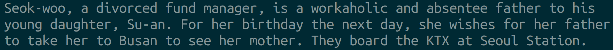
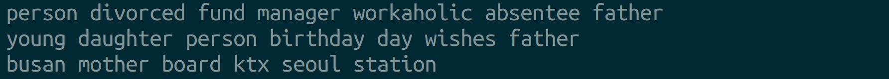
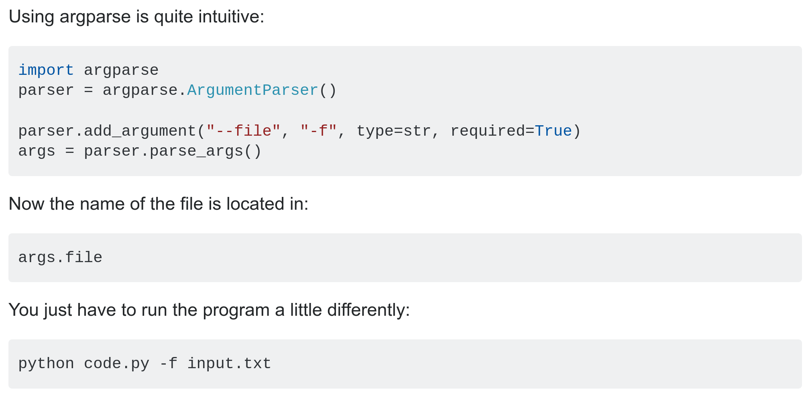

# Movie Description Pre-Processing Project
<!-- markdownlint-disable MD029 MD033 -->
<!-- cspell: disable -->

## Introduction

You're tasked with creating a text pre-processing pipeline for movie description clustering. Your script should read in a movie description and write a condensed version that will be the input for another script that clusters the movie descriptions. You aren't responsible for creating the clustering script.

Let's make the assignment more specific using an example. The `data` folder contains a Wikipedia movie description of the 2016 South Korean thriller **Train to Busan**. The description is in the text file `train_to_busan_description.txt`. 

<p align="center">
    
</p>

<p align="center">source: Wikipedia</p>

You will create a script `src/description_parser.py` that takes a text
file (in this case `data/train_to_busan_description.txt`) as an input
argument and writes a condensed version of the text file as output (in
this case `parsed/train_to_busan.txt`).

Note that the three files mentioned above exist in different directories,
as indicated by the text preceding the forward slash:  

* `src/`  The source directory where Python scripts (`*.py`) are stored.  
* `data/` The directory where the **original** text descriptions
  (`*.txt`) are stored.
* `parsed/` The directory where **parsed** text versions (`*.txt`) of the
  movie descriptions will be stored.

The script needs to run from Terminal (the command line) in the root
directory of the project like so:  

```bash
python src/description_parser.py -i data/train_to_busan_description.txt -o parsed/train_to_busan.txt 
```

This results in the creation of `parsed/train_to_busan.txt`. Showing just
the first three lines, the images below shows how
`src/description_parser.py` should transform the text from the
description to the parsed version.

`data/train_to_busan_description.txt`  


`parsed/train_to_busan.txt`  


As you can see, `train_to_busan.txt` is a line-by-line transcription of
the `train_to_busan_description.txt` but with the following
modifications:

* it's in a different directory (`parsed` instead of `data`)
* all the text has been **lower-cased**
* **punctuation** has been removed
* words that are common (e.g "at", "the", "for" which are often referred
  as stopwords) have been removed
* people's names have been replaced with "person"

This assignment will walk you through creating this application.

## Part 1: Explore the data with Python

You should get a sense of what the data is like before making the application.

You can simply navigate to the text file and read it using the command line utility `less`:

```bash
less data/train_to_busan_description.txt
```

Now explore it more quantitatively using Python. We've provided a data exploration script for you.

Run the exploration script from the project root directory:

```bash
python src/explore_data.py
```

This script will show you:
- How many characters, lines, and words are in the file
- Sample text from the beginning of the file
- What types of characters are present (uppercase, lowercase, punctuation, numbers)
- A preview of unique words

Review this output carefully. It will help you understand what transformations your text processing pipeline needs to perform.

## Part 2: Prepare your local work environment

Now that you've explored the text and understand what needs to be done, let's set up your work environment for writing code.

A useful workflow requires a text editor and Terminal. Navigate to the repository from Terminal, then use VSCode to open the project:

```bash
cd ~/path/to/repo/movie-pre-processor
code .
```

Note the space then period (.) after code above. The period signifies the current directory (we're inside `movie-pre-processor` so open up VSCode inside this repository).

You can also use VSCode's [integrated Terminal](https://code.visualstudio.com/docs/editor/integrated-terminal) to run your Python code.

## Part 3: Fill in the `text_parsing_functions.py` functions

The `description_parser.py` file will need text parsing functions to condense the movie descriptions. These functions _could_ be written in the `description_parser.py` file itself, but these text parsing functions could also be useful in other applications.

So develop and test the text parsing functions in a separate script called `text_parsing_functions.py` and then, once they are working as desired, _import_ them into the `description_parser.py` file for use.

`text_parsing_functions.py` has been started for you. It's in the `src` folder.

Fill in the functions in `text_parsing_functions.py`, starting from the top. Make sure you return values from the functions, and delete `pass` as you do.

**Important notes:**
- Each function has a docstring explaining what it should do
- The `Examples` section shows expected input and output
- Helpful hints are provided in comments (look for `# Hint:`)
- The first function (`lowercase_text`) is already completed as an example

Test each function as you go by adding test code under the `if __name__ == '__main__':` block. An example is provided showing how to test the `lowercase_text` function.

You can run this script from Terminal:

```bash
python src/text_parsing_functions.py
```

As you implement each function, add your own test code to verify it works correctly.

## Part 4: Create and implement `description_parser.py`

The file `text_parsing_functions.py` now contains working line-cleaning functions. Now these functions can be imported and used by other Python files.

Make a `description_parser.py` file in the `src` directory, and add the following lines to it:

```python
# Import the text parsing functions
import text_parsing_functions as tpf


if __name__ == '__main__':
    # Load stopwords from file
    stopwords = tpf.load_stopwords('data/stopwords.txt')

    # Character names that should be replaced with 'person'
    replace = 'person'
    names = set(
        ['suan', 'seongkyeong', 'yonsuk', 'seokwoo',
         'ingil', 'yonghuk', 'jinhee']
    )

    # Test the pipeline with a sample line
    line_text = (
      "pregnant wife Seong-kyeong, "
      "a high school baseball team, "
      "rich-yet-egotistical"
    )
    cleaned_text = tpf.line_cleaning_pipeline(line_text,
                                              stopwords,
                                              names,
                                              replace)

    print(cleaned_text)
```

Note that this script imports functions from the `text_parsing_functions.py` script and that those functions are accessed using the `tpf.` alias.

Execute this code from Terminal:

```bash
python src/description_parser.py
```

## Part 5: Read a text file line-by-line

To work, `description_parser.py` needs to read in a file line-by-line and pass each line to the line-cleaning-pipeline. Using the **With Statement** construction in this [blog](https://www.geeksforgeeks.org/read-a-file-line-by-line-in-python/), add a function to `description_parser.py` that takes a filepath, opens it, and prints out each line.

Add this under your `if __name__ == '__main__':` block:

```python
filepath = 'data/train_to_busan_description.txt'
```

Then create and call a function that reads and prints each line from that file.

## Part 6: Clean text line-by-line

Now refactor your function that reads and prints all the lines in a file to take each line, clean it using the `line_cleaning_pipeline`, and then print it out.

If that works, then refactor your code to return one large list instead, where each element in the list is one cleaned line of text.

## Part 7: Write each element of a list to a file

Once that's working, consult this [Stack Overflow Answer](https://stackoverflow.com/questions/7138686/how-to-write-a-list-to-a-file-with-newlines-in-python3) to learn how to write each element of a list to a file.

Write to the `parsed` directory in the project. Remember to specify `parsed/train_to_busan.txt` as the path to write to. For now, put that path in your `description_parser.py` under the `if __name__ == '__main__':` block.

**Note:** You may need to create the `parsed` directory first if it doesn't exist. You can do this from Terminal:

```bash
mkdir parsed
```

## Part 8: Provide paths from command line via ArgParse (Stretch Goal)

Finally, you would rather not hard-code paths into your code. It's better to enable your code to take other files and paths from the command line. This [Stack Overflow Post](https://stackoverflow.com/questions/7033987/python-get-files-from-command-line) succinctly describes how to use ArgumentParser to get these arguments from the command line.

<p align="center">
    
</p>

Implement ArgumentParser so that you can execute your code like this:

```bash
python src/description_parser.py -i data/train_to_busan_description.txt -o parsed/train_to_busan.txt
```

Consult the Python documentation to learn more about ArgumentParser.

Congratulations! You've just written your first Python application!

## Additional Resources

- [Python String Methods](https://docs.python.org/3/library/stdtypes.html#string-methods)
- [Python File I/O](https://docs.python.org/3/tutorial/inputoutput.html#reading-and-writing-files)
- [ArgumentParser Tutorial](https://docs.python.org/3/howto/argparse.html)
